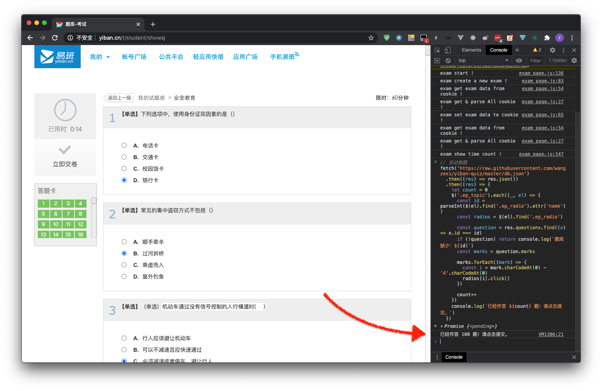

## 易班题库辅助脚本

易班题库自动答题，一秒答完一百道！💯

## 本题库已收录

- 纪律与处分规定
- 安全教育

## 使用说明

1. 复制 `main.js` 内全部代码
2. 打开 `易班` 答题页面
3. 按下 `F12` 打开开发者窗口
4. 找到 `Console` 面板
5. 按下 `ctrl+v` 贴入代码
6. 按下 `回车`

静待十秒，题目将会作答完毕。



## 如何制作题库

首先使用 `util.js` 内的随机做题代码，在浏览器中反复刷题，使尽可能多的题进入 `我的错题`。
然后使用 `index.js` 抓取 `我的错题` 数据，生成 `db.json`，进而生成 `main.js`。

注意，抓取 `我的错题` 首先需在 `.env` 中填入 `COOKIES` 环境变量。

```shell
$ cd src # 进入 src 目录
$ npm install # 安装依赖
$ npm start # 启动抓取与生成
```

## 协议

MIT
